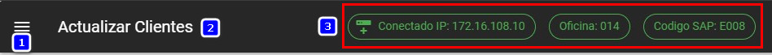
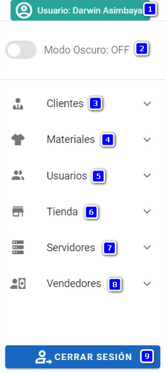
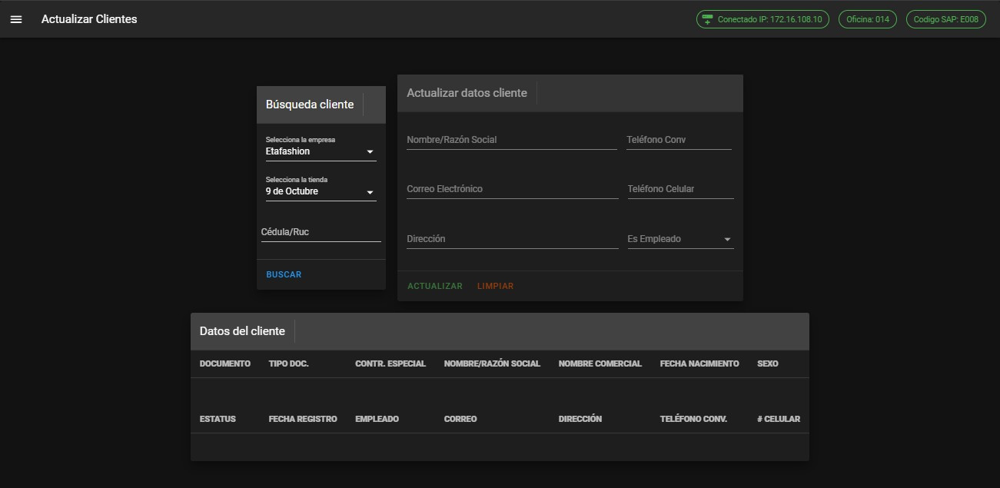

# Inicio

Una vez ingresado con las credenciales correctas se, se visualiza la pantalla principal en donde se tiene los siguientes elementos:

### Menú, título e información

En esta barra se encuentra el botón para le menú **(1)** , el título del módulo **(2)**, información adicional **(3)** sobre la IP de la tienda, la oficina y el código SAP.

***

***

### Menú

En el menu encontraremos las siguientes opciones:
***

***

1. Usuario que se encuentra logueado en la aplicación
2. Opción para establecer el **modo oscuro** de la aplicación
<!--  -->
3. [Clientes](../04-Clientes/)
    - [Actualizar clientes](../04-Clientes/#actualizar-clientes)
    - [Facturas clientes](../04-Clientes/#facturas-clientes)
    - [Respuesta WS Crédito](../04-Clientes/#respuesta-ws-credito)
    - [Transacciones clientes](../04-Clientes/#transacciones-clientes)
4. [Materiales](../05-Materiales/)
    - [Artículos](../05-Materiales/#articulos)
5. [Usuarios](../06-Usuarios/)
    - [Autorizador devolución](../06-Usuarios/#autorizador-devolucion)
    - [Usuarios tienda](../06-Usuarios/#usuarios-tienda)
    - [Usuarios logueados](../06-Usuarios/#usuarios-logueados)
6. [Tienda](../07-Tienda/)
    - [Cajas abiertas](../07-Tienda/#cajas-abiertas)
    - [Ip cajas](../07-Tienda/#ip-cajas)
    - [Oficinas](../07-Tienda/#oficinas)
    - [Promociones](../07-Tienda/#promociones)
7. [Servidores](../08-Servidores/)
    - [Ejecución Jobs](../08-Servidores/#ejecucion-jobs)
    - [Discos duros](../08-Servidores/#discos-duros)
    - [Respaldos Bdd](../08-Servidores/#respaldos-bdd)
8. [Vendedores](../09-Vendedores/)
    - [Vendedores tienda](../09-Vendedores/#vendedores-tienda)
9. Cierre de la sesión

    

::: tip NOTA
La sesión se cerrará dentro de 15 minutos si el usuario no realiza ninguna acción en el aplicativo
:::
