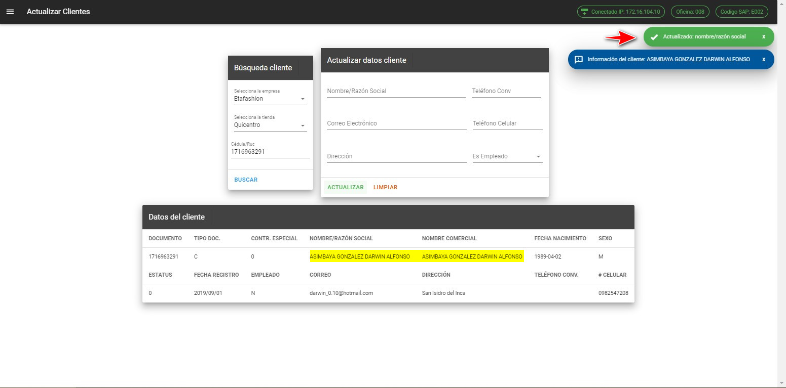

# Clientes

En este módulo se desarrolló con las consultas que más se realiza día a día en soporte POS, en este módulo se realiza búsquedas y actualizaciones referente a los clientes.

## Actualizar Clientes

En la interfaz de actualizar clientes, podemos consultar o realizar actualizaciones de los datos del cliente, la búsqueda se realiza por medio de la cédula o ruc.

### Consultar cliente

Para realizar la búsqueda del cliente debemos escoger la empresa, la tienda y llenar el campo de cédula o ruc para consultar la información del cliente.

::: danger Importante
* Todos los campos son requeridos para realizar la búsqueda del cliente.

* El campo **cédula/ruc** debemos ingresar los valores correctos para la búsqueda se debe ingresar 10 dígitos para la cédula y 13 para el Ruc.
:::

::: danger Mensaje no existe 
Si buscamos una cédula o ruc que no existe o falta ingresar nos aparecerá el siguiente mensaje:

:::

::: tip Retención
Si en la búsqueda del cliente se realiza con RUC, se activa el botón **RETENCIÓN**.

En este cuadro podemos ingresar los datos para aplicar la retención del cliente que lo requiera, los datos se deben ingresar conforme al SRI.

:::

### Actualizar datos cliente

Al presionar el botón ***Actualizar*** sin tener ninguna información en los cuadros de textos **Nombre/Razón Social, Correo Electrónico, Dirección, Teléfono Convencional, Teléfono Celular, Empleado**, mostrará el siguiente mensaje:

::: danger Importante
Todos los campos están validados para que puedan ingresar la información solicitada.

:::

::: tip Actualización
Si actualiza cualquier campo se mostrará un mensaje de que se ha actualizado la información de acuerdo con el campo se haya ingresado, esta información se actualiza en tablas de la tienda y matriz. 

:::

::: warning Limpiar
 Para limpiar el formulario de actualizar debemos presionar el botón **Limpiar**  
:::

## Facturas clientes

El interfaz de facturas clientes podemos consultar las facturas realizadas en la tienda que necesitemos.

### Consultar facturas

Al realizar la búsqueda de facturas debemos escoger la empresa, la tienda y una de las tres opciones para consultar las facturas.
Al escoger la opción Número de factura se habilita el campo Número de factura este campo es obligatorio para realizar la búsqueda por número de factura.

::: danger Importante
* Todos los campos son requeridos para realizar la búsqueda del cliente.

* Para la búsqueda del **número de factura** deben ingresar 15 dígitos si no se cumple esta condición no se realizará la consulta

* El campo **cédula/ruc** debemos ingresar los valores correctos para la búsqueda se debe ingresar 10 dígitos para la cédula y 13 para el Ruc.
:::

Para la búsqueda de factura por el número de cédula se requiere que el campo ***Número de cédula***  que no este vacío y sea una cédula o ruc correcto para su búsqueda.

La opción búsqueda todas las facturas nos permite visualizar todas las facturas realizadas en la tienda, es consulta nos trae los primeros 30 registros que se tenga en la tienda, en esta opción no se habilitará ningun campo.

::: tip Nota
Una vez escogido cualquiera de las tres opciones y presionado el botón buscar nos mostrara la información de la o las factura que mandemos a consultar tanto de la tienda como matriz.
:::

::: danger Mensaje no existe
Si buscamos por el número de factura y no existe ni en la tienda ni en matriz se tiene siguiente mensaje:

Los mismo ocurre cuando buscamos una cédula que no existe

:::

::: tip Botones detalle y forma de pago
Si se encuentra una factura en la tienda se habilita los botones ***DET*** y ***FP***

El botón ***DET*** nos mostrará el detalle de la factura que estamos buscando.

El botón ***FP*** es la forma que de pago que realizo en dicha factura.

:::
## Respuesta WS Crédito

En la interfaz Respuesta WS Crédito podemos consultar la repuesta del servicio de crédito que realizaron en la tienda.

### Consultar respuesta servicio de crédito  
Para realizar la búsqueda tenemos que conocer el nombre o los nombres del cliente para poder realizar la consulta, al ingresar ya sea un nombre, un apellido o el nombre completo, nos reflejara los datos del cliente que estamos consultando.

::: danger Importante
* Todos los campos son requeridos para realizar la búsqueda del servicio de crédito.
:::

::: danger Mensaje no existe 
Si buscamos por un nombre que no existe nos aparecerá el siguiente mensaje:

:::

## Transacciones clientes

En la interfaz transacciones clientes podemos consultar los pagos o facturas realizado por el cliente en el mismo día.

### Consultar transacciones
Para realizar la búsqueda debemos escoger la empresa, la tienda e ingresar la cédula o Ruc del cliente que queremos consultar.

::: danger Importante
* Todos los campos son requeridos para realizar la búsqueda de las transacciones.
:::

::: danger Mensaje no existe 
Si buscamos por la cédula y no existen transacciones de ese cliente nos aparecerá el siguiente mensaje:

:::

:::tip Offline
Para revisar si alguna transacción se realizo ***Fuera de línea*** debemos presionar el botón **OFFLINE**

Las transacciones ***Fuera de línea*** nos aparecerá tanto de la tienda y matriz
:::