# Materiales
En este módulo podremos verificar todos artículos que nos reportan, hay campos que podemos actualizar, ejecutar etc. 

## Artículos

En la interfaz de artículos vamos a consultar todos los datos referente a los materiales, esta consulta se realiza tanto en la tienda como en matriz, adicional podremos actualizar el estado del material o comunicar dicho material de matriz a la tienda, vamos a realizar algunas consultas en esta interfaz.

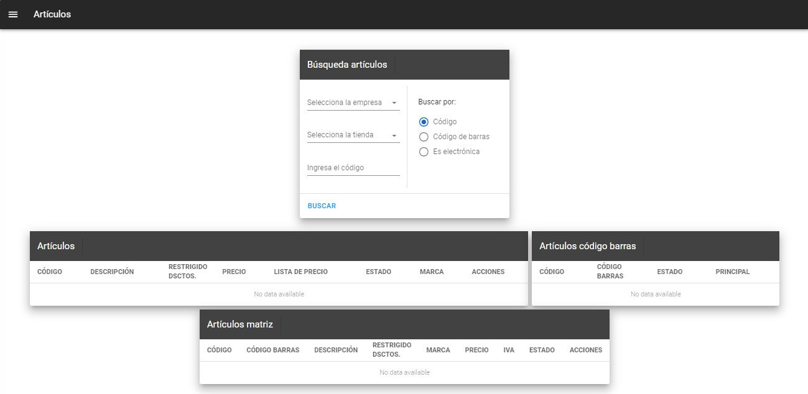

### Consultar artículos

Al realizar la búsqueda por código de cualquier material tenemos que escoger la empresa, la tienda y completar el campo **Código**, en los cuadros **Artículos**, **Artículos código barras** y **Artículos matriz** obtendremos los datos dicho material.

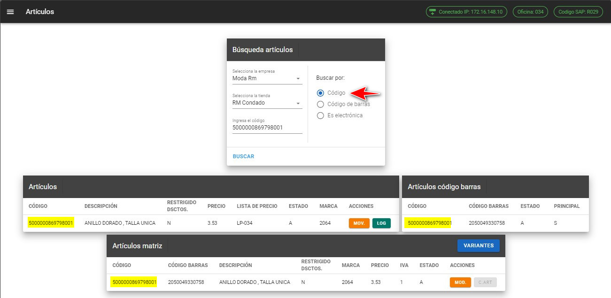

Al realizar la búsqueda por código de barras debemos escoger la ópcion de **Buscar por Código de barras**, los códigos que nos muestra son todos los códigos atados a ese mismo código de barras.

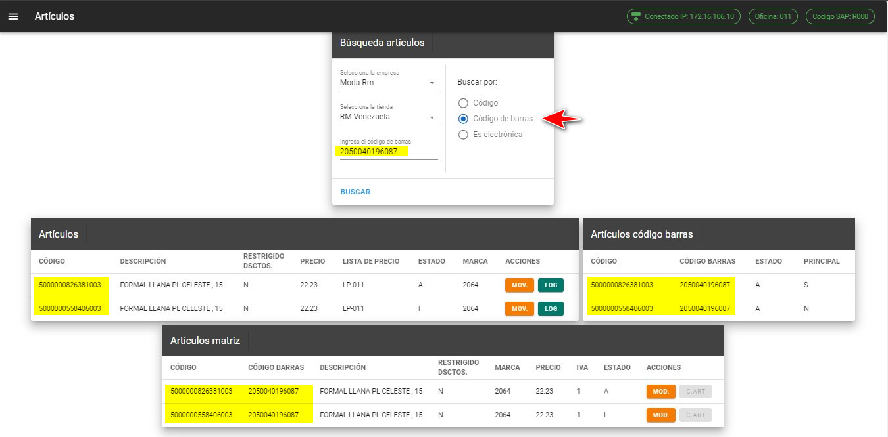

Opción **Es electrónica** nos permite consultar el segmento que se encuentra dicho material, esta consulta se debe realizar con el código del material.

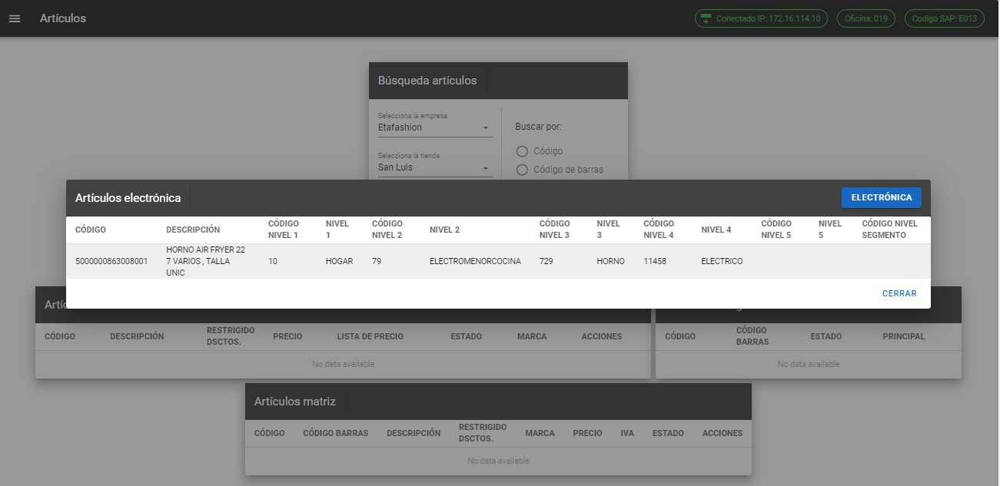

::: danger Importante
* Todos los campos son requeridos para realizar la búsqueda del material.

* El código debe contener al menos 13 caracteres para la búsqueda.

* El código de barras debe contener 13 caracteres para la búsqueda.
:::

::: danger Mensaje no existe
Si buscamos un código en cualquiera de las tres opciones y este no se encuentra nos aparecerá cualquiera de los siguiente mensajes:
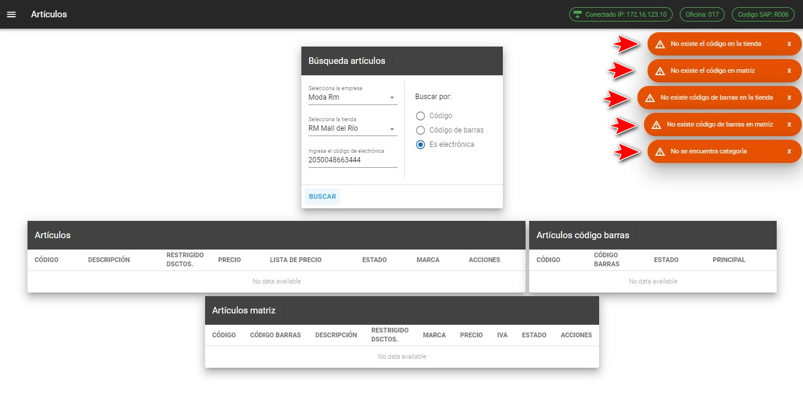
:::

::: tip Cambiar Restringido Dsctos o Estado del material

Para cambiar ***RESTRINGIDO DSCTOS***. o el ***ESTADO*** del material debemos posicionarnos en los datos de los campos en mención  y dar un clic, esto nos abrirá los cuadros de diálogos y debemos escoger una de las opciones que nos muestra.

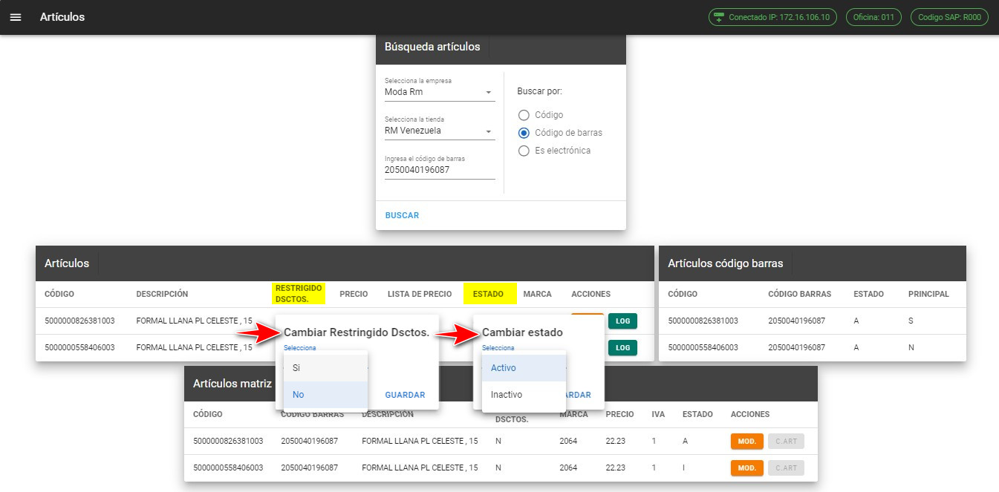

Una vez actualizado nos aparecera cualquiera de los siguientes mensajes:
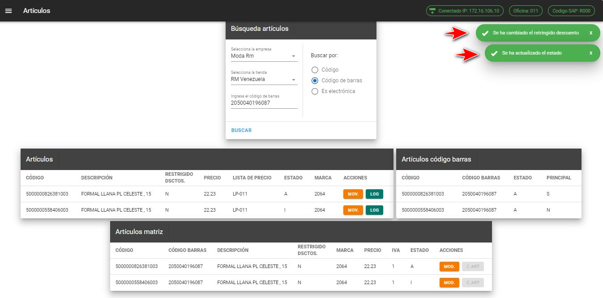
::: warning Nota
 Al cambiar el ***ESTADO*** de material se actualizara tanto en la tienda, matriz y en la tabla de codigo de barras 
:::

### Consultar movimientos artículos

Una vez realizado la consulta del material nos aparecerá los botones **MOV.** y **LOG**

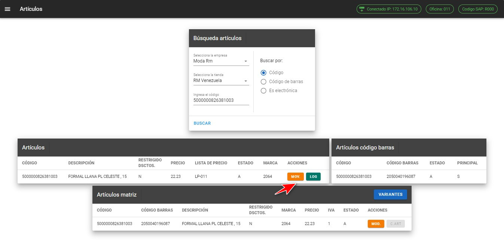

Para buscar los movimientos que se tiene el material debemos presionar **MOV**, esta consulta nos muestra todos los movimientos que se tenga de ese material, esta consulta se realizar tanto en la tienda como en matriz.

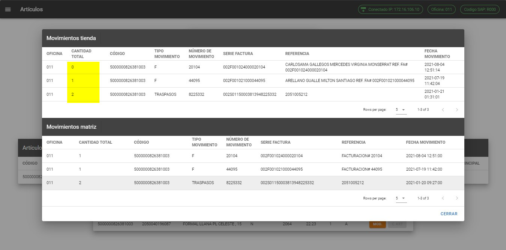

::: tip Regularizar movimientos
Si hay movimientos que regularizar de matriz a la tienda nos aparecerá el botón de **REGULARIZAR INVENTARIO**, al presionar el botón nos va regularizar todos lo movimientos que tenga el material. 
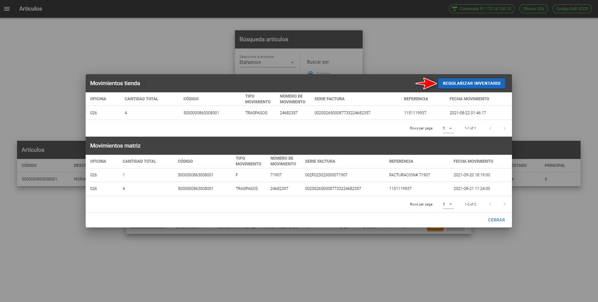
:::

::: danger No existen movimientos
Si al presionar el botón ***MOV.*** no existen movimientos nos aparecerá el siguiente mensaje:
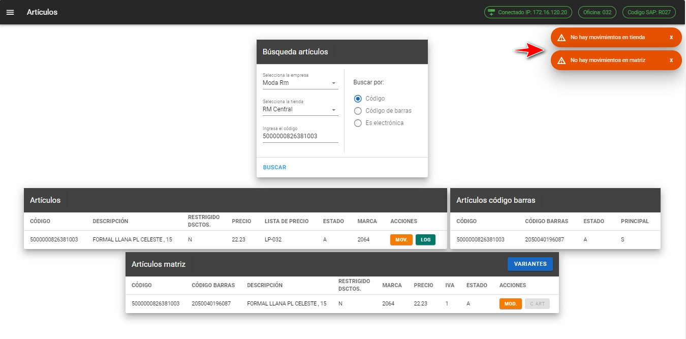
:::

### Consultar log artículos

Para buscar los log de promociones del material debemos presionar el botón **LOG**, esta consulta nos muestra todas la promociones que tiene dicho material. 

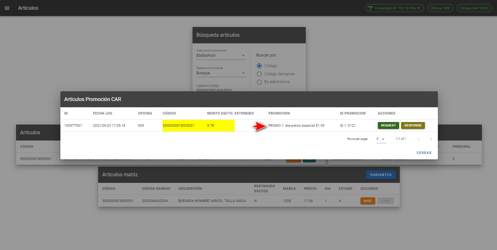

::: tip REQUEST
Para verificar el **REQUEST** que se envía al servicio de promociones de CAR, nos mostrara el texto que se envía de ese material
* Al presionar el boton azul vamos a poder copiar todo el texto de request.
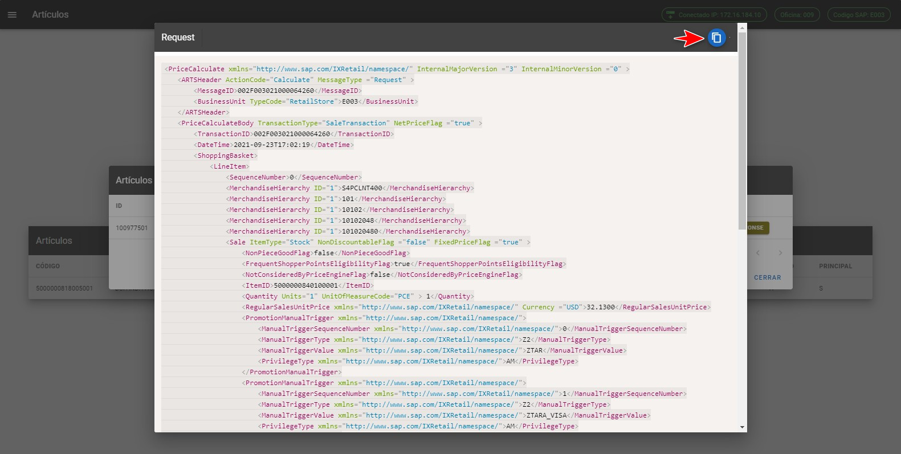

:::
::: tip RESPONSE
Al presionar el botón **RESPONSE** nos va a mostrar el texto de lo que nos respondió el servicio de promociones de CAR.
* Al presionar el boton azul vamos a poder copiar todo el texto de response.
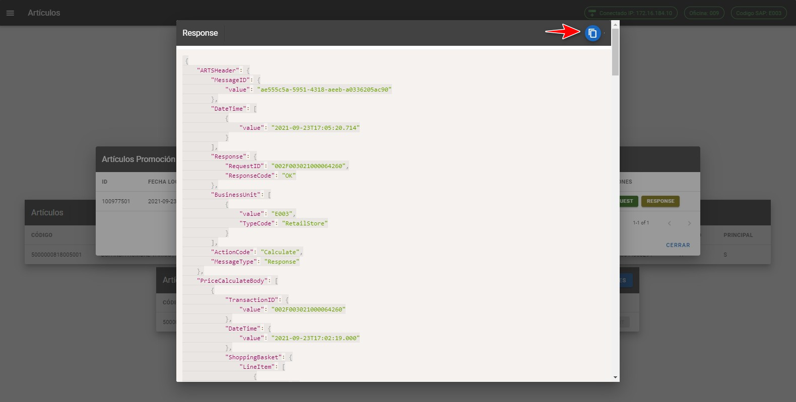

:::

::: danger No exsite log movimientos
Si al presionar el botón ***LOG.*** no hay log de promociones nos aparecerá el siguiente mensaje:
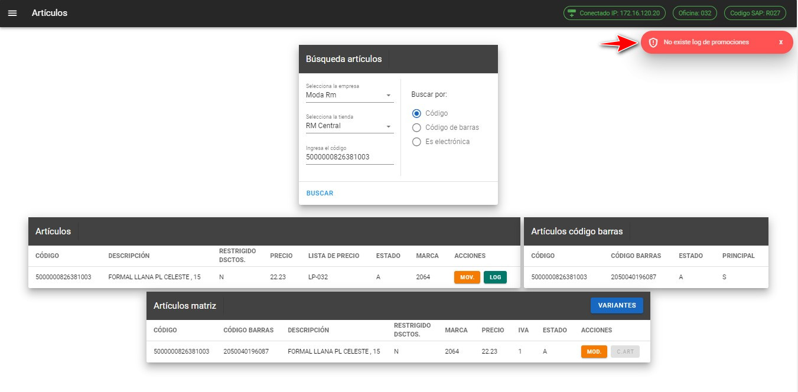
:::

### Buscar variantes
Una vez realizado la búsqueda del material nos aparecerá el botón **VARIANTES** en el cuadro  de matriz, esto nos mostrara todas las variantes que se tiene tanto en matriz como en la tienda.
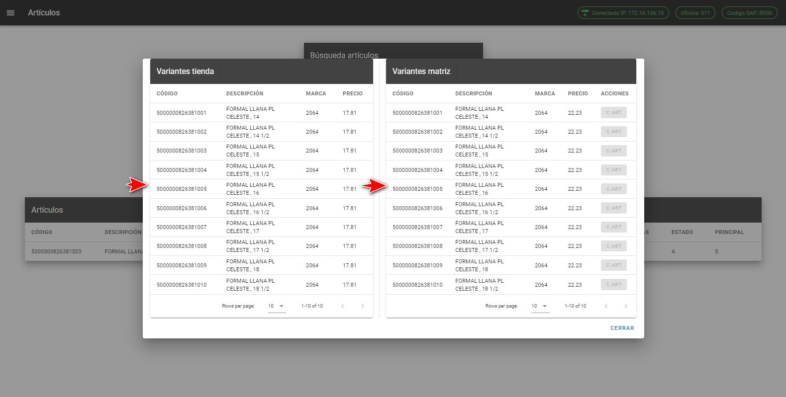

:::tip Nota
El botón de **VARIANTES** solo estará habilitado si se busca con la opción ***Buscar por Código***
:::

### Comunicar artículos

El botón **C.ART** es para comunicar un artículo esto ayuda a comunicar el artículo que no existe en la tienda pero si en matriz se habilita el botón, adicional si el material tiene precio, marca el botón estará habilitado para poder ejecutar el procedimiento almacenado comunicar un artículo. 

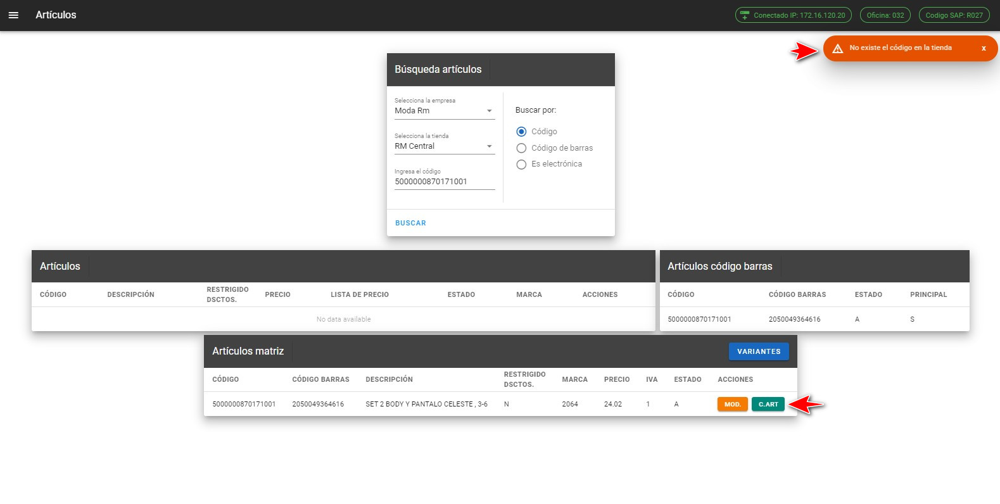

:::tip Ejecutar C.ART
Una vez ejecutado el comunicar un artículo nos aparecerá el siguiente mensaje:
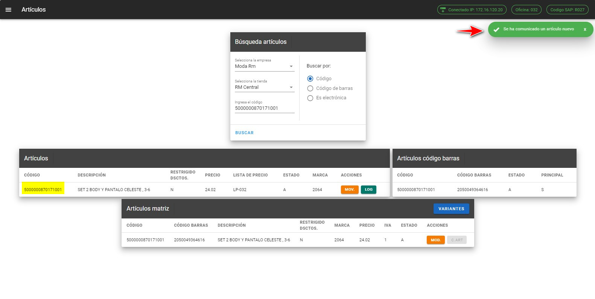
* El botón C.ART también esta habilitado para las variantes. 
:::