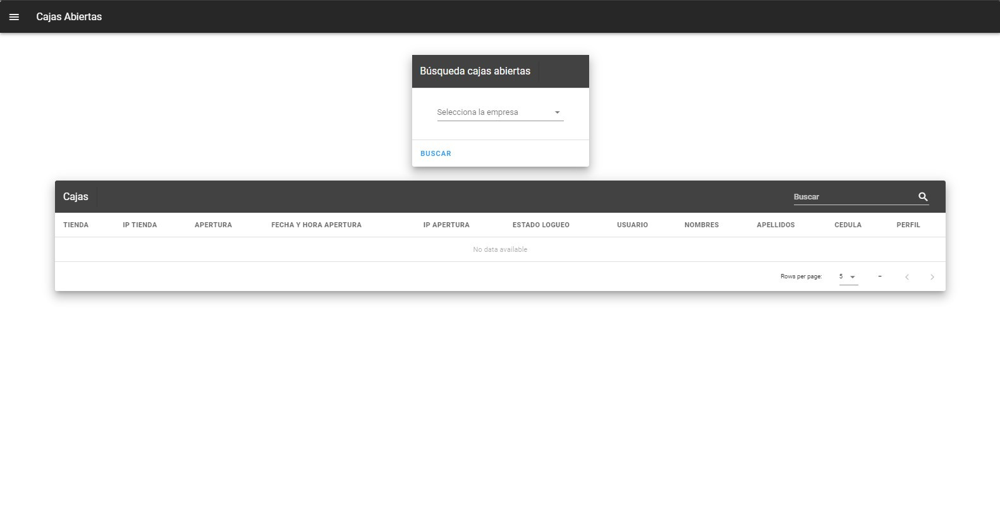

# Tienda

En este módulo se desarrolló con la finalidad verificar información relacionado con la tienda

## Cajas abiertas

En la interfaz cajas abiertas vamos a poder consultar todas la cajas se tienen abiertas en todas las tiendas ya sea ETA, RM o CR.

### Consultar cajas abiertas
Al consultar las cajas abiertas vamos a verificar que cajas, usuarios, fecha etc.  tiene abierto y en que tienda, para realizar la consulta vamos a escoger la empresa que queremos consultar y nos desplegara la información de las cajas en todas la tiendas.

Para buscar una tienda en concreto podemos utilizar el cuadro de texto **Buscar**, esto nos puede ayudar a filtrar por tienda, usuario, fecha, etc.

## IP Cajas

En este interfaz podemos consultar las IPs, Tid, Mid, etc. De la tienda que escojamos.

### Consultar Ips cajas

Para realizar la consulta vamos escoger la empresa y la tienda que necesitemos consulta, una vez realizado nos mostrará toda la infromación relacionado con las cajas.

## Oficinas
Desde esta interfaz podemos generar el listado de las tiendas por empresa

## Consultar Oficinas

Para realizar la consulta de la oficina debenos escoger la empresa y luego presionamos en Buscar y nos retorna todas las tiendas que pertenecen a la empresa seleccionada.

Para buscar una tienda en concreto podemos utilizar el cuadro de texto **Buscar**, esto nos puede ayudar a filtrar por la tienda, oficina, etc.

## Promociones

Esta interfaz se realizó para consultar todos los logs que se tenga en la tienda.

### Consultar promociones
Para realizar la consulta debemos escoger la empresa y la tienda, esto nos ayudara a realizar la consulta de todos los logs de promociones que realizaron en la tienda.

### Botones de acciones
:::tip VER
El botón **VER** no va a mostrar todas las promociones que realizaron en una factura.

:::

::: tip REQUEST
Para verificar el **REQUEST** que se envía al servicio de promociones de CAR, nos mostrara el texto que se envía de ese material
* Al presionar el boton azul vamos a poder copiar todo el texto de request.

:::
::: tip RESPONSE
Al presionar el botón **RESPONSE** nos va a mostrar el texto de lo que nos respondió el servicio de promociones de CAR.
* Al presionar el boton azul vamos a poder copiar todo el texto de response.

:::
