# Servidores
En este módulo se desarrolló para realizar consultas a los servidores, esta consultas son las mas importantes para poder verificar el correcto funcionamiento de los servidores de la tienda.
## Ejecución Jobs
En esta interfaz vamos a poder revisar todos los Jobs que se ejecutan día a día en las tiendas.

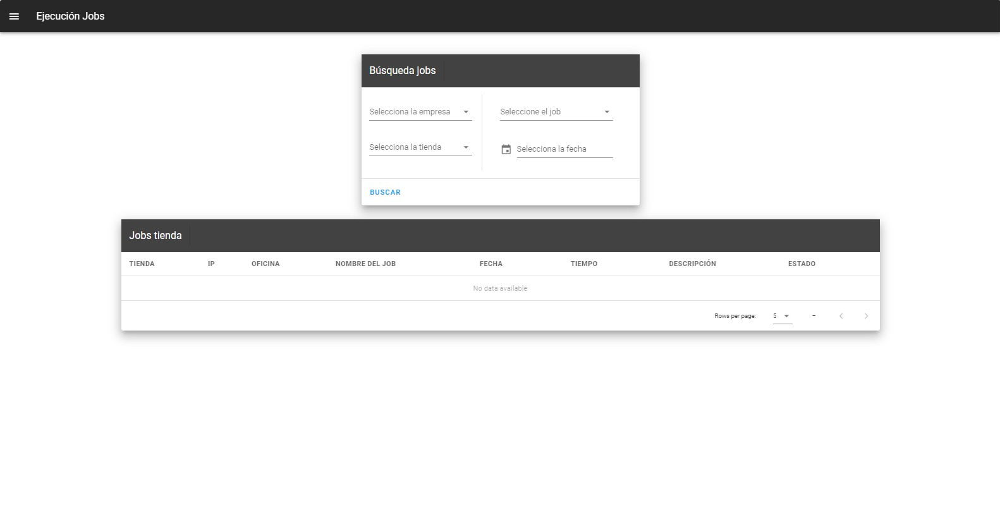
### Consultar Jobs tienda
Para realizar la consulta debemos escoger la empresa, la tienda, el job a consultar y las fecha que se desea sacar.
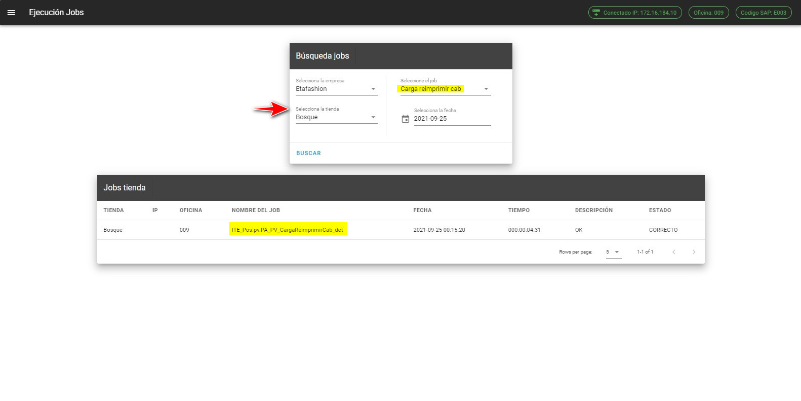

Podemos consultar todos los Jobs de una tienda en específico, para realizar esta consulta debemos escoger en la opción de Jobs **Todos**
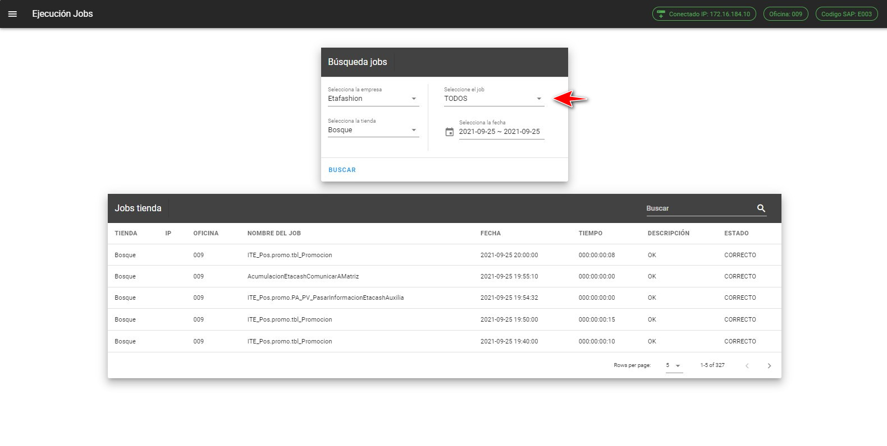

Tambien podemos realizar la consulta de todas las tienda y un Job específico.
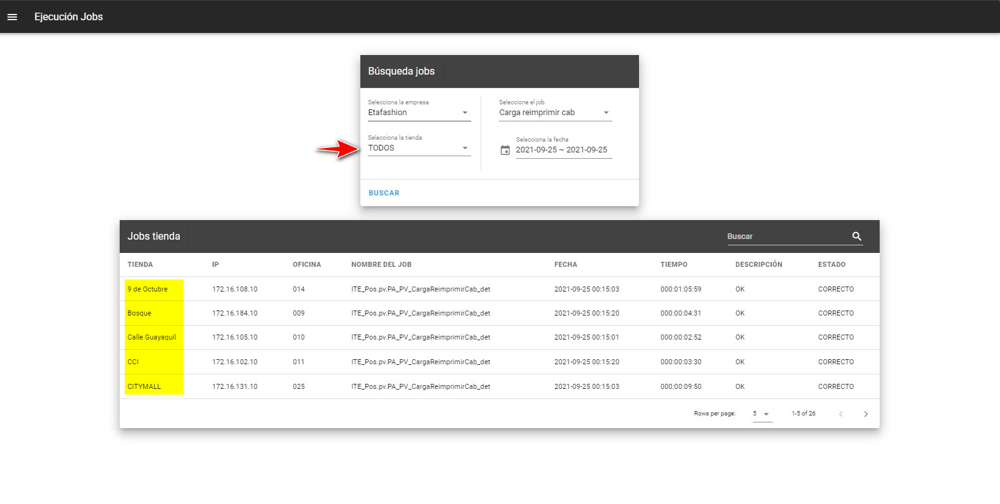

::: tip Nota
Al seleccionar la fecha podemos escoger un rango no mayor de 15 días para poder realizar la consulta.
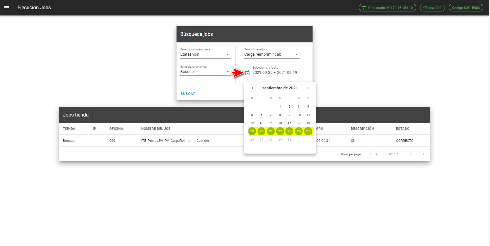

Si escogemos una rango de fechas mayor a 15 días nos aparecerá el siguiente mensaje.
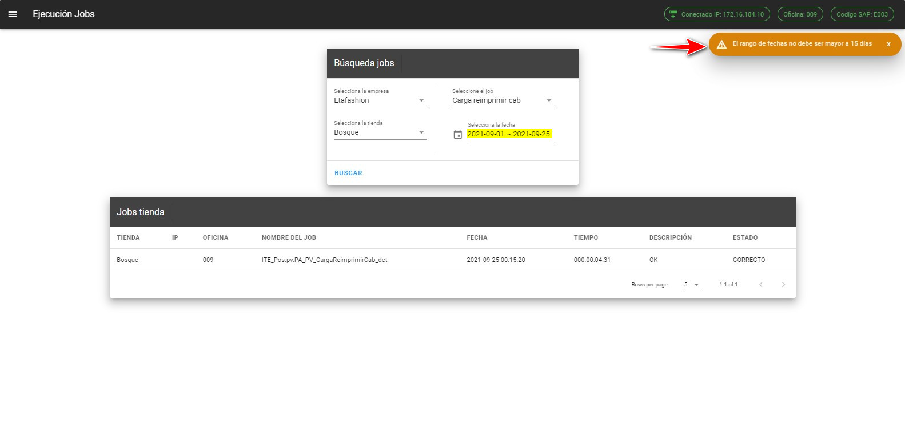
:::

::: danger Error
Si tratamos de consultar los Jobs de todas las tienda nos va salir el siguiente mensaje:
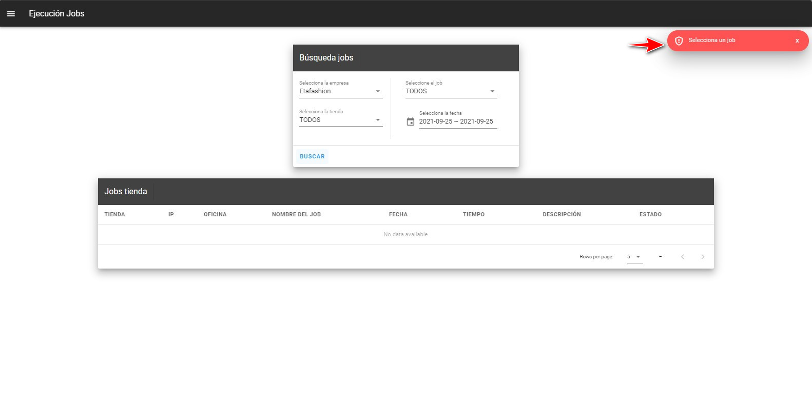

:::
::: danger Importante
Todos los campos son obligatorios para la consulta.
:::

### Consultar fecha servidor

Esta consulta nos puede ayudar a verificar que la fecha de todos los servidores sean los correctos, y no tener novedad al momento de apertura la caja.

Para realizar la consulta debemos escoger el job **Control Fecha servidor**

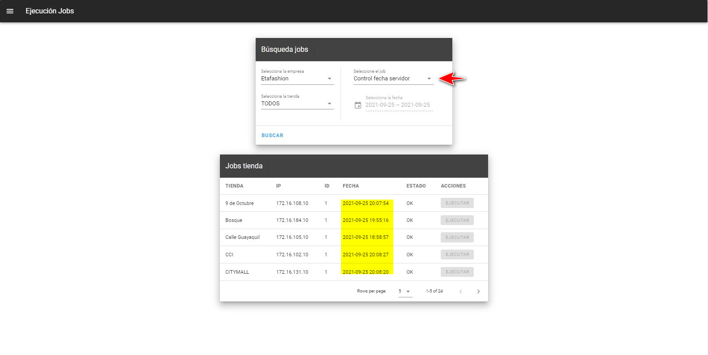

::: tip Botón Ejecutar
Este botón estará habilitado siempre y cuando la fecha se incorrecta
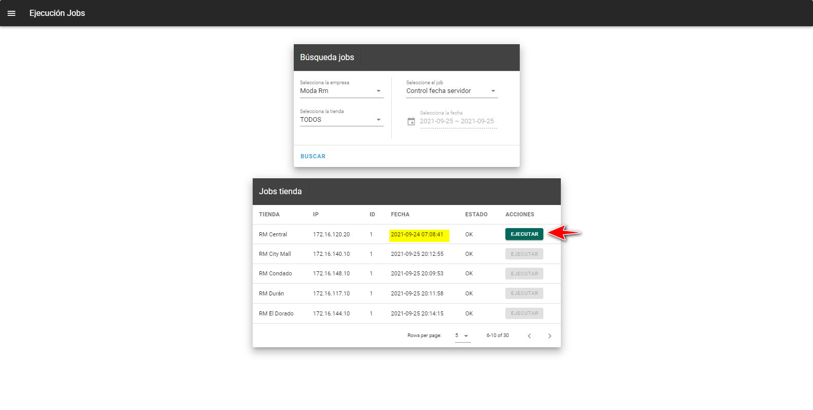

Si presionamos el botón ejecutar se realizar la actualizacón de la fecha del servidor y nos mostrará el siguiente mensaje:
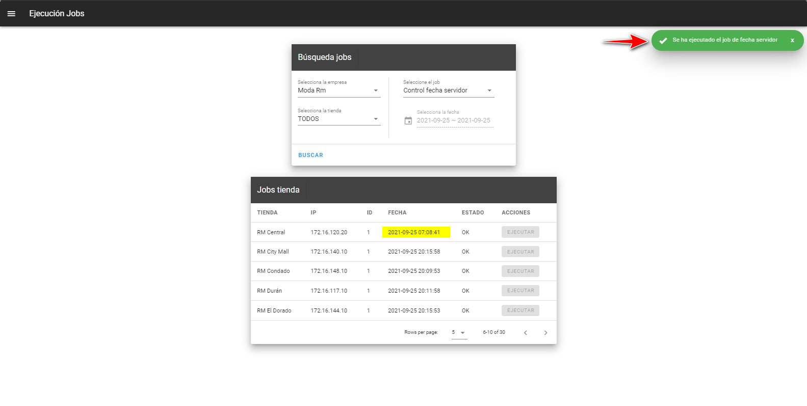

:::
## Discos Duros

En esta interfaz vamos a consultar el espacio en el disco de los servidores de todas las tiendas.
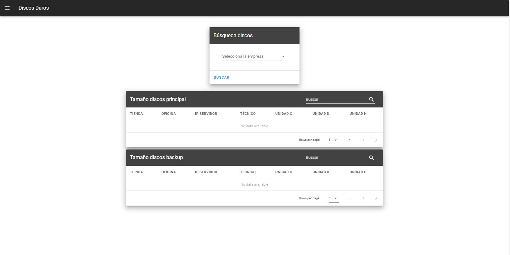

### Consultar espacio en disco

Para realizar la consulta debemos escoger la empresa y nos retornara la información de las unidades de discos duros con el espacio libre que se tiene, esta informacion tenemos tanto de los servidores principales como los de contingencia.
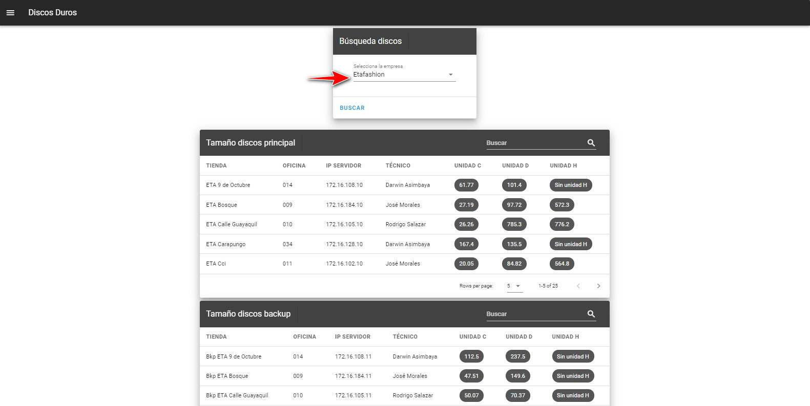

::: danger Importante
Si el espacio del disco es menor a los 20Gb se va tornar de color rojo para la revisión de ese servidor.
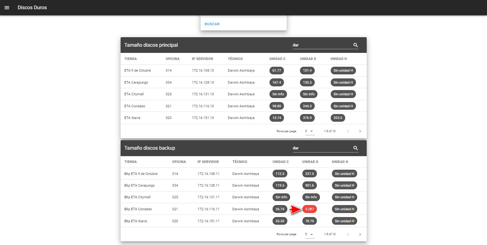
:::
## Respaldos BDD

En esta interfaz vamos los respaldos de la bases de datos que se realizan desde el sevidor principal al de contingencia, este proceso lo realiza a diario.

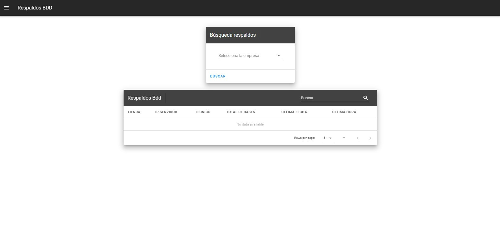

### Consultar respaldos Bdd

Para consutar los respaldos que se tiene en la tienda vamos escoger la empresa en que queremos consultar, esto nos traerá toda la información de todas las tiendas.

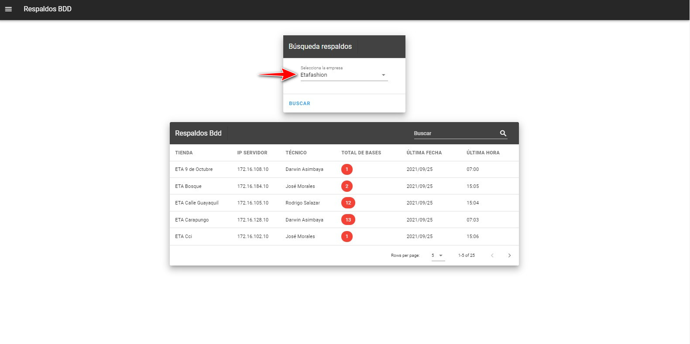

::: danger Importante
Si el total de las bases de datos es menor a 12 bases de datos nos mostrará en color rojo en número de bases que se paso a los servidores de contingencia.
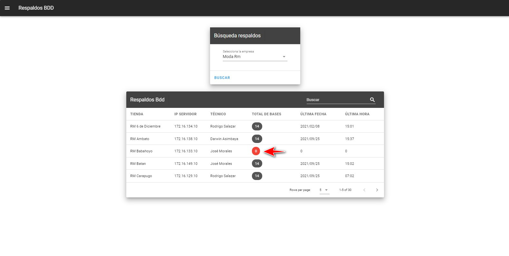
:::